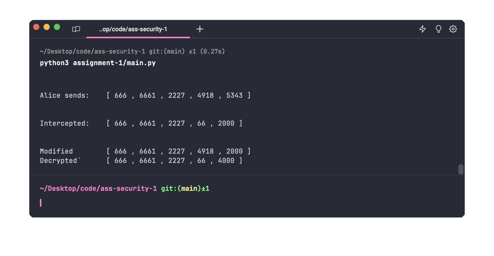

# Report

Made by: Lucas Hanson (<luha@itu.dk>) for the course Security 1 at ITU.

## Approach

### Encrypt

First I wanted to encrypt the message 2000, as described in the assignment.
I used the approach given in the slides of lecture 4, page 18.
So first to encrypt the message (in `main.encrypt`) I choose a random private key **y**.
Then I calculated `g^y%p` (which I called **c1**) where **g** is the public key.
Then I encrypted the message (which I called **c2**) by calculating `(PK^y)*M%p`.
So now Alice can send the message including c1 and c2.

### Intercept

Eve now intercepts the message.
This is done in `main.intercept`.
I therefore have to guess the private key given the public available information.

I made a for loop that went through from 0 (should have started from 1 since 0 can not be chosen as a private key) to 6661 which is the public shared prime.
This was done since we know that the private key is between 1 and the public shared prime.
Then in each iteration of the loop, the digit guessed (**d**) `g^d%p` was calculated and seen if it matched the public key PK.
This was done as we know the public key is generated by taking the prime (g) to the power of the private key (x or in the bruteforce code d) modulo the prime (p).
When d made the calculation match the public key we knew we had the private key.

We now had to decrypt the message.
This was done by following Wikipedia's description since I was unable to make the description in the slides work.
The description followed can be found [here](https://en.wikipedia.org/wiki/ElGamal_encryption).
This was done by first calculating the inverse by using the formula given by Wikipedia `c_1^(q-x)`.
Then by discussing the issue with alumnies, I was told that there needed to be a minus one in the formula making it look like this `c_1^(q-1-x)`.

Then the message could be decrypted by using Wikipedias formula `c_2*inverse`.
Since ElGamal uses cyclic groups the result modulo the prime was also found.
This then gives a decrypted message.

### Modify

Now Weave wants to modify the message.
I just tried to multiply the message with two and modulo the prime (for good measure).
This worked and when the message was decrypted it was 4000.

## Results

The results of the program can be seen below:

In each of the outputs the first part of the output has the following format:

| Description | Public shared base | Public shared prime | Bob's public key
| --- | --- | --- | --- |

The rest of the output is different based on the method which is running.\
For Alice the last two fields are the c1 and c2.\
For Eve that intercepts the message it is the private key of Bob (which has been brute forced) and the decrypted message.\
For Weave that modifies the message it is the same c1 that Alice used and the modified c2. After that I decrypted it for good measure to show that it worked.
